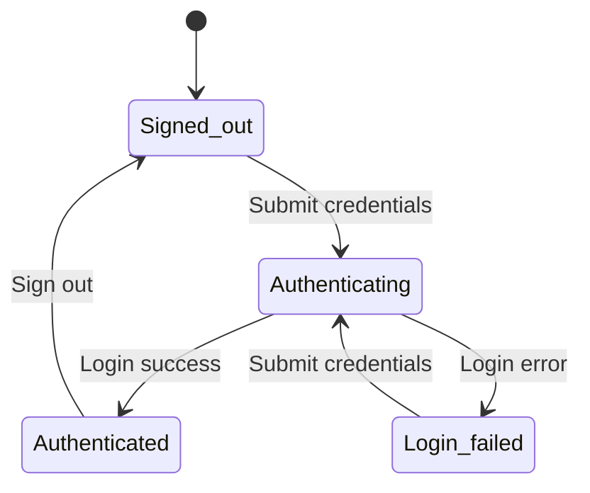

# State machine

Let's discover what a state machine is and why they are so useful 🚀.

## What is a state machine?

A state machine library provides a structured way to manage an object's state and the rules governing transitions between states. It simplifies complex workflows by defining distinct states, events, and transitions, ensuring predictable and controlled state changes. With features like guards for conditional transitions, actions triggered upon entering or exiting states, and event handling, state machine libraries allow developers to implement clear, maintainable logic in applications. This is especially useful for scenarios like user interactions, workflows, and process automation, where the object’s behavior depends on its current state.

### Basic authentication flow example

This state machine represents a user authentication flow, where users start in a signed-out state and can initiate authentication by submitting credentials. The process moves to authentication, where the system verifies credentials. Based on the outcome, users either successfully log in or encounter a login failure. If authentication fails, users can reattempt login, repeating the cycle until successful. Once authenticated, users remain logged in until they choose to sign out, returning to the initial signed-out state. This flow ensures controlled transitions and reattempts, enhancing the reliability of the authentication process.
