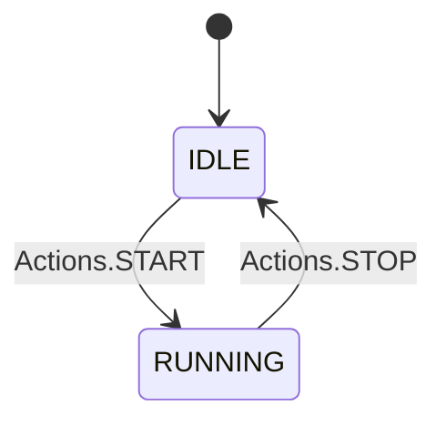

# Triggering actions

Once you have a [machine instance](./instantiating-machines.md) you can start triggering actions.

## What actions are?

In a state machine context, actions are operations or triggers that drive transitions between states. Actions are typically the "inputs" that cause the state machine to change from one state to another according to defined rules.

In your `StateMachine<S, A>` class, the generic parameter A represents the type of actions used within the state machine. This allows you to define specific action types that the state machine can handle, making it possible to customize behavior based on different kinds of events or inputs, represented by A. This approach helps maintain type safety and allows flexibility in defining what each action does within the machine.

See here an example of actions defined as an `enum`:

```csharp
enum Actions {
    START,
    STOP
}

string initialState = "IDLE";

// In this example states are string values, actions are Actions (from the enum defined above) and the context is an integer (int) value
var machineBlueprint = StateMachine<string, Actions, int>.Factory((eb) => {
    // States
    var idleState = eb.AddState("IDLE");
    var runningState = eb.AddState("RUNNING");

    // Transitions
    idleState.AddTransition(Actions.START, "RUNNING");
    runningState.AddTransition(Actions.STOP, "IDLE");
}, initialState);
```

This diagram represents the states flow defined in the past example:

<div style={{ textAlign: "center" }}>



</div>

## Triggering an action

If you want to trigger an action you can do so by using the `Trigger` method from a instantiated machine. This methods accepts an `A` (Action type) value. Once called, the machine will perform a transition if there is a defined transition with this action between the current state and another one.

Example:

```csharp
// We instantiate the machine
var machine = machineBlueprint();

// We transition to START via Actions.STOP action
machine.Trigger(Actions.START);
```

This example works because we defined a transition from IDLE to RUNNING througth the Actions.START action. See the diagram above.
